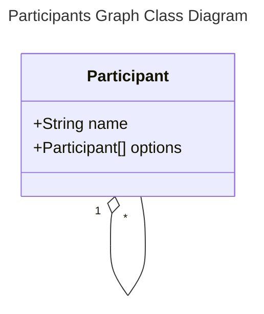
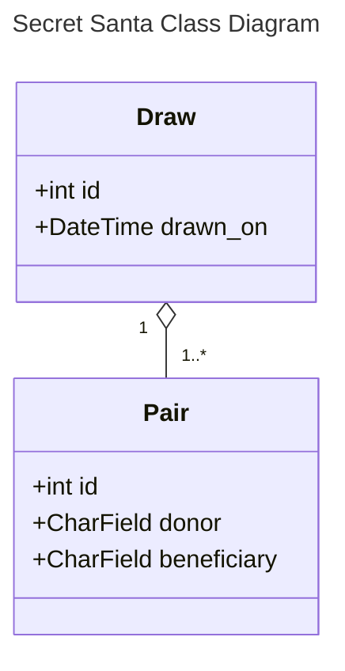

Akeneo's Secret Santa
===


<a href="http://www.freepik.com">Designed by Freepik</a>

This project is homework for my application at the French company named [Akeneo](https://www.akeneo.com/fr/).

# Subject
Create an application to draw Secret Santa lists. Each participant is expected to make and
receive a single gift.


Features include:
* a blacklist, to exclude arbitrary participant associations;
* a five draws history.

# Implementation
The core code of the exercise is located in `secret_santa/secret_santa/lib.py`. It's designed
to run in three steps that are run sequentially.
(The three steps are currently run in `ProcessForm.is_valid()`.)

## 1/3 Parse & Clean
The first step is to parse and clean the inputs (blank lines, trailing whitespaces) from the
HTML form, and then model the data using a custom `lib.Participant` class.
This produces a __graph__ of all the participants and the beneficiaries they _could_ be
giving a gift to.



## 2/3 Secure Single Beneficiary Participants
Then, due to either the size of the participants list or the number of exclusions in the blacklist,
some participants can only give a gift to __a single beneficiary__.
We “secure” these participants by removing their single beneficiary from all other participant
options.

## 3/3 Run a Backtrack algorithm
Finally we run a _backtracking algorithm_ to find a suitable path through all the participants.

# Development Considerations
For simplicity the Django project does not contain any app.

The project uses the [Django REST framework](https://www.django-rest-framework.org) (DRF) toolkit on
top of Django, and a __PostGreSQL__ database.

The database schema is very simple. It's designed to store __valid draws__ only. Below is the
related class diagram.


The REST API only offers __reading__ endpoints, to list draws and pairs.
(DRF offers a web interface to browse the APIs: http://localhost/api/.)
The data will be written from Django after the submission of a valid `/process` form payload.

Besides the REST API, two other views are available: the dashboard and the processing view
(with the HTML form).

| Method | Endpoint      | Details                                          |
|--------|---------------|--------------------------------------------------|
| GET    | `/api/draw`   | List draws and their attributes.                 |
| GET    | `/api/draw/X` | Get a single draw attributes.                    |
| GET    | `/api/pair`   | List pairs and their attributes.                 |
| GET    | `/api/pair/X` | Get a single pair attributes.                    |
| GET    | `/`           | Dashboard. List draws history.                   |
| GET    | `/process`    | Show the input form.                             |
| POST   | `/process`    | Process the inputs to build a Secret Santa draw. |

# Build & Run
The project can be deployed locally using __Docker__ and __Docker-Compose__. The project is built
on top of a Python 3.12.4 container (based on Linux Debian).

For now the project is run on Django's web development server. This is not suitable for production
environments.

A `Makefile` regroups the most useful `docker-compose` commands. Here is the basic sequence:
```sh
make build
make up
# browse http://localhost, http://localhost/api, http://localhost/process
make clean
```

Two fixtures files are provided to populate the database with realistic data: `draw.yaml` and
`pair.yaml`. They are already loaded by the `make up` target.

The form on http://localhost/process is initialised with demonstration data for simplicity.
In its current state this form shows an error message when a satisfying draw cannot be made,
and it redirects to the dashboard when a Secret Santa list can be made.
No data are saved into the database.

# What's missing?
1. A connection from `ProcessForm.is_valid()` to `ProcessView.form_valid()` to pass the processed draw and __save it into the database__.
2. Automated library unit tests.
3. A basic global HTML template (doctype, head, header, stylesheet, footer).
4. A dynamic frontend application implemented with Vue.js.

# How to improve?
* Add a production-ready web server (e.g.: Nginx).
* Add a "do your best" feature to reach a result even when no convenient draw can be found. The program would gradually drop constraints until a valid result is made possible.
* Manage user authentication.
* Write a blackbox automated test scenario using Selenium.
* Store the raw inputs alongside the draws (for replay, debugging, statistics, etc.).
* Improve `/api/draw` and `/api/draw/X` REST serializers so they include the participants pairs.
