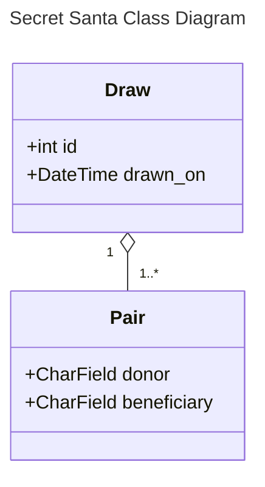

Akeneo's Secret Santa
===


<a href="http://www.freepik.com">Designed by Freepik</a>

This project is homework for my application at the French company named [Akeneo](https://www.akeneo.com/fr/).

# Subject
Create an application to draw Secret Santa lists. Each participant is expected to make and
receive a single gift.


Features include:
* a blacklist, to exclude arbitrary participant associations;
* a five draws history.

# Development Considerations
For simplicity the Django project does not contain any app.

The project uses the [Django REST framework](https://www.django-rest-framework.org) (DRF) toolkit on
top of Django.

## Class Diagram


The REST API only offers __reading__ endpoints, to list draws and pairs.
DRF offers a web interface to browse the APIs: http://localhost/api/.


| Method | Endpoint | Details                          |
|--------|----------|----------------------------------|
| GET    | `/api/draw`  | List draws and their attributes. |
| GET    | `/api/pair`  | List pairs and their attributes. |

# Build & Run
The project can be deployed locally using __Docker__ and __Docker-Compose__.

For now the project is run on Django's web development server. This is not suitable for production
environments.

A `Makefile` regroups the most useful `docker-compose` commands.
```sh
make build up
```

# Clean
```sh
docker-compose down -v --remove-orphans
```

# How to improve?
* Add a production-ready web server (e.g.: Nginx).
* Add a "do your best" feature to reach a result even when no convenient draw can be found. The program would gradually drop constraints until a result is produced.
* Manage user authentication.
* Write a production configuration file (e.g.: `settings-production.py`).
